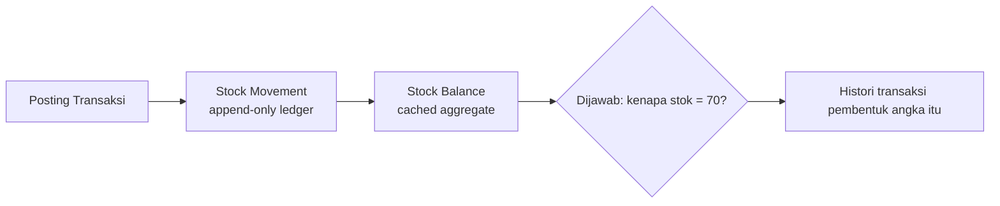

<div align="center">

# Warehouse Stock Management System

**Sistem manajemen gudang (WMS) end-to-end: setiap perubahan stok berasal dari transaksi yang tercatat — akurat, auditable, dan tidak pernah negatif.**

[](https://laravel.com)
[](https://www.php.net)
[](https://livewire.laravel.com)
[](https://tailwindcss.com)
[](https://www.mysql.com)
[](https://github.com/dmsfauzan/stockmanagement/actions/workflows/tests.yml)
[](#pengujian)
[](#lisensi)

[Fitur](#fitur) ·
[Mulai Cepat](#mulai-cepat) ·
[Arsitektur](#arsitektur) ·
[Keamanan](#keamanan--validitas) ·
[Roadmap](#roadmap)

</div>

---

## Kenapa proyek ini

Kebanyakan aplikasi stok menyimpan angka `on_hand` yang bisa diubah bebas. Aplikasi ini tidak. Di sini **ledger adalah satu-satunya sumber kebenaran**:



- **Tidak ada angka ajaib.** Setiap saldo bisa ditelusuri ke transaksi pembentuknya.
- **Atomic & concurrency-safe.** Posting memakai `SELECT ... FOR UPDATE`, lock baris balance, dan rollback penuh saat stok tidak cukup.
- **Tidak ada penghapusan histori.** Koreksi dilakukan lewat Reversal/Adjustment, bukan `DELETE`.

## Fitur

<details open>
<summary><b>Phase 1 — Inti operasional</b></summary>

| Modul | Keterangan |
|---|---|
| Master Barang | SKU & barcode unik, kategori, supplier, unit, status |
| Kategori / Unit / Supplier / Customer-Department | CRUD penuh + pencarian & filter |
| Warehouse → Zone → Rack → Location | Hirarki multi-gudang |
| Barang Masuk (`GR-YYYYMMDD-XXXX`) | DRAFT → SUBMITTED → APPROVED → POSTED / REJECTED |
| Barang Keluar (`GI-YYYYMMDD-XXXX`) | Alur sama + pengecekan stok sebelum posting |
| Stock On Hand / Movement / Low Stock | `Available = On Hand − Reserved`, otomatis |
| Dashboard | KPI, grafik movement, distribusi kategori, low stock, aktivitas terkini — **widget dapat dipilih & diurutkan per user** |
| Reports | Stock / Incoming / Outgoing / Movement / Expiry / Opname / Adjustment / Transfer / Warehouse Comparison / Valuation / COGS / Journal / Replenishment / Sales Order → CSV, Excel, PDF |
| RBAC | 43 permission granular, 4 peran |
| Audit trail | Siapa, apa, kapan, nilai lama → baru |

</details>

<details>
<summary><b>Phase 2 — Kontrol stok lanjutan</b></summary>

| Modul | Keterangan |
|---|---|
| Stock Adjustment (`ADJ-...`) | System vs actual qty, alasan, workflow approval, reversal |
| Stock Opname (`OPN-...`) | Generate daftar item → hitung fisik → varians → approve → auto-generate & post Adjustment |
| Transfer Barang (`TR-...`) | Antar lokasi & antar gudang: REQUESTED → APPROVED → IN_TRANSIT → RECEIVED → COMPLETED, ledger `TRANSFER_OUT/IN` |
| Notifikasi in-app | Low/out of stock, approval request, hasil approval, opname, transfer |

</details>

<details>
<summary><b>Phase 3 — Produktivitas (sebagian)</b></summary>

| Modul | Keterangan |
|---|---|
| Barcode / QR | Halaman `/scan` (scanner USB + kamera), label item/lokasi + cetak bulk, prefill `?scan=` di form transaksi |
| Reserved Stock | Stok "dipesan" dokumen terbuka menahan `available`; lepas saat reject/post/dispatch |
| Batch & Expiry | Tracking batch/expiry, report kedaluwarsa, alert dashboard, notifikasi batch ≤ 7 hari |
| Lot / Serial | `tracking_type` per item (none/batch/serial), tabel `stock_lots`, stok per lot/serial, FEFO |
| Konversi Satuan | Satuan majemuk per barang (mis. 1 BOX = 12 PCS) di form Barang; posting transaksi otomatis dikonversi ke satuan dasar (`base_quantity`); tabel konversi di Detail Barang + API `?include=conversions`; dropdown satuan dapat dibatasi ke konversi terdaftar (**Settings → Inventory**) |
| QC / Karantina | Barang Masuk bertanda **Perlu Inspeksi** masuk ke bucket karantina; `Available = On Hand − Reserved − Karantina`; halaman **Inventory → Karantina** (Loloskan / Tolak) + export, API `/quarantine`; lot/serial berstatus karantina tidak ikut FEFO |
| Warehouse Scoping | Setiap user dibatasi ke **1/N gudang** (pivot `user_warehouse`, toggle "Semua gudang") via **Admin → Users**; stock/movement/report/API/switcher + posting disaring ke gudang yang diizinkan |
| Analitik Inventori | Laporan **Aging** (bucket umur stok), **ABC** (kelas pemakaian 80/15/5), **Perputaran** (turnover + hari persediaan), **Slow/Dead stock** — web + export CSV/Excel; ambang slow/dead di **Settings → Inventory**; API `/reports/aging|abc|turnover|slow-moving` |
| Lacak Lot / Serial | Halaman **Inventory → Lacak Lot** menelusuri riwayat satu batch/serial dari ledger (masuk → transfer → keluar → retur) + API `/traceability/{batch|serial}/{value}` |
| Picking & Packing | Pick list (`PL-...`) dari barang keluar disetujui, diurutkan per jalur gudang, konfirmasi per baris (short-pick) → selesai → dikemas, dengan **packing slip** cetak; web + API `/pick-lists/*` |
| Kitting / BOM | **Bill of Materials** per barang (tab di form Barang) + perintah **Perakitan/Pembongkaran** (`ASM/DIS-...`) yang mengonsumsi & menghasilkan via ledger atomik, dengan reversal; web + API `/assembly-orders` |
| Prakiraan Permintaan | Forecast berbasis riwayat keluar (rata-rata bergerak + tren), **safety stock** (service-level z-score) & **reorder point**; web + export; ambang di **Settings → Inventory**; API `/reports/forecast|/reports/forecast/{id}` |
| Kapasitas Gudang | **Kapasitas BIN** opsional per lokasi + report utilisasi (normal/penuh/padat), API `/reports/capacity` + saran penempatan `/put-away-suggestion` |
| Multi-Mata Uang | Mata uang + kurs (histori `exchange_rates`) dikelola di **Admin → Mata Uang**; PO menyimpan mata uang & kurs ke dasar; API `/currencies` + `/currency/convert` |
| Konsinyasi | **Kepemilikan** per barang (Milik Sendiri / Konsinyasi + pemilik); filter di Daftar Barang & Laporan Valuasi; ownership tampil di Detail Barang & API |
| Purchase Requisition | Requisition (`PR-...`): Draf → Diajukan → Disetujui/Ditolak → **Konversi ke PO**; web + API `/requisitions/*` |
| Tarik Batch (Recall) | Tandai batch/serial bermasalah + lihat dampak (stok tersisa & dokumen terdampak), tandai lot `recalled` lalu cabut; web + API `/recalls/*` |
| Cycle Counting | Opname parsial per zona/rak (`type=cycle`), command `inventory:cycle-count` terjadwal mingguan |
| Landed Cost | Biaya kirim/lainnya pada Barang Masuk dialokasikan (by value/qty) ke average cost |
| FEFO Picking | Barang Keluar pilih lot/serial otomatis dari expiry terdekat (`applyFefo`) |
| ERP / Accounting | Outbound **webhook** bertanda-tangan HMAC + **ekspor jurnal terjadwal** (CSV/XLSX) + API `/api/accounting/*` |
| Import Barang | Excel/CSV dengan template, validasi per baris, upsert by SKU (diproses di latar belakang) |
| Import Master | Excel/CSV untuk **Kategori, Satuan, Supplier, Customer, Warehouse, Location** — template, validasi per baris, upsert by code, notifikasi hasil |
| Email Report | `reports:mail --report=stock\|low\|movement\|valuation\|expiry --period=daily\|weekly\|monthly` (jadwal 06:30/06:45 Senin/1-an 07:00), penerima & batas baris di **Settings → Reports** |
| Retensi Movements | `inventory:archive [--days= --dry-run --force]` memindah `stock_movements` lama ke `stock_movement_archives` (jadwal Minggu 02:30), ambang di **Settings → Inventory** |
| OpenAPI Docs | Dokumentasi interaktif `/docs/api` + spec `/docs/api.json` (Scramble, auto-generate, gated `viewApiDocs`) |
| i18n (ID/EN) | Bahasa per user (switcher di topbar) — chrome, tabel/tombol, status badge, toast/validasi, **pesan validasi + pagination**; kamus `lang/{id,en}` |
| Price List | Harga jual per barang + **price list per pelanggan bertingkat** (`min_quantity`); SO auto-isi harga (tier → harga jual → cost); halaman **Detail Customer** + API `/customers/{id}/prices` |
| Multi-Level Approval | Persetujuan bertingkat berbasis **ambang nilai** + role per level + **maker-checker** (pembuat/approver sebelumnya tak boleh menyetujui); riwayat approval; aktif via **Settings → Approval** |
| Security Monitor | Deteksi serangan app-layer (login gagal/lockout, 403/419/429, scanner path), geo-IP negara, auto-ban IP, halaman **Admin → Security** + export CSV |
| API Token Abilities | Permission middleware **menegakkan abilities token Sanctum** (token terbatas benar-benar dibatasi, token tanpa abilities = akses penuh user) |
| API Idempotency | Header **`Idempotency-Key`** pada request write — respons di-replay bila retry (`Idempotent-Replay`), payload beda → 409; retensi via `idempotency:purge` (TTL 24 jam) |
| CORS | `config/cors.php` — origin dari `CORS_ALLOWED_ORIGINS` (default `*`, ketat di produksi); expose `Idempotent-Replay` |
| Upload Aman | Lampiran adjustment `pdf/jpg/jpeg/png/webp` + nama aman; `ImageService` normalisasi ekstensi dari mime |
| CSP | `Content-Security-Policy` moderat via `SecurityHeaders` (konfigurabel di `security.csp`), nonaktif bila `null` |
| Sanctum & 2FA | Expiry default 30 hari untuk token baru + **Rotate** di **Admin → API Tokens**; recovery code 2FA **di-hash**; notifikasi login/password/2FA |
| Dependensi | CI menjalankan `composer audit` + `npm audit` (high+); **Dependabot** mingguan (composer/npm/actions) |
| Anti Human-Error | Jadwal `withoutOverlapping`/`onOneServer`; seeder aman (tanpa reset password, guard produksi); **import preview dry-run**; stale-edit guard di 7 form transaksi; konfirmasi ketik-ulang (`PURGE`); zona waktu tampilan **Asia/Jakarta** (simpan UTC) |
| Reversal | Koreksi transaksi posted tanpa menghapus histori |
| Retur Penjualan | **Retur customer** (`CRT-...`): Draft→Submitted→Approved→Posted (multi-level approval + reversal), tautan partial ke Barang Keluar, posting `return_in` + laporan |
| Retur Pembelian | **Retur supplier** (`SRT-...`): workflow sama, tautan partial ke Barang Masuk, posting `return_out` + laporan |
| Laporan Retur | `/reports/returns` (web + export + API `/api/reports/returns`) |
| Purchase Order | PO (`PO-...`) → Barang Masuk (penerimaan sebagian), progres penerimaan |
| Sales Order | SO (`SO-...`): Draft→Submitted→Approved→Partial→Fulfilled→Closed, fulfilment via Barang Keluar |
| Multi-Warehouse | Switcher gudang global (session), dashboard per gudang, report perbandingan gudang |
| Valuation / COGS | Harga pokok rata-rata bergerak (moving average), COGS, report valuasi & COGS |
| **REST API** | Sanctum token, ~72 endpoint (read + tulis workflow), permission- & rate-limited, format konsisten — lihat [`API.md`](API.md) |
| Advanced Supplier | Lead time, termin, price list, skor on-time & variasi harga |
| Replenishment | Saran beli dari min/max + buat PO sekali klik |
| PWA | Installable, app-shell offline, scan kamera di HP |

</details>

## Arsitektur

```mermaid
flowchart TB
    subgraph UI[Browser]
        B[Blade + Livewire + Alpine + Tailwind]
    end
    subgraph APP[Laravel 13]
        MW[Middleware: auth, permission, EnsureAccountActive]
        LW[Livewire Components]
        SVC[Services: InventoryService · LedgerService<br/>ReservationService · ExpiryService<br/>DocumentNumberService · AuditLogger]
        POL[Policies & Gates]
    end
    subgraph DB[(MySQL 8)]
        LEDGER[(stock_movements<br/>single source of truth)]
        BAL[(stock_balances<br/>cached)]
    end
    B --> MW --> LW --> SVC --> DB
    SVC --> LEDGER --> BAL
```

**Penomoran dokumen** (`GR/GI/TR/ADJ/OPN-YYYYMMDD-XXXX`) memakai tabel `document_sequences` dengan row-lock — aman dari duplikat saat transaksi bersamaan.

**Formula stok** (identik di dashboard, detail item, report):

```
Stock On Hand = Opening + Incoming + Transfer In + Adjustment In
                − Outgoing − Transfer Out − Adjustment Out
Available     = On Hand − Reserved
```

## Mulai Cepat

### Persyaratan

| Tool | Versi |
|---|---|
| PHP | ^8.3 (`pdo_mysql`, `mbstring`, `zip`, `gd`, `bcmath`, `intl`, `xml`, `fileinfo`) |
| Composer | ^2.10 |
| Node + npm | ^24 + ^11 |
| MySQL | 8.0 (Laragon membundel semuanya) |

### Instalasi (5 menit)

```bash
composer install
cp .env.example .env

# buat database stockmanagement di MySQL (utf8mb4_unicode_ci)
php artisan key:generate
php artisan migrate --force
php artisan db:seed --force

npm install
npm run build

php artisan serve
```

Buka `http://127.0.0.1:8000` dan masuk dengan akun demo di bawah.

> Windows + Laragon? PHP/MySQL sudah tersedia — tidak perlu instal apa pun. Lihat juga `composer setup` di `composer.json`.

### Akun Demo

| Email | Password | Peran |
|---|---|---|
| `admin@stock.test` | `password` | Administrator (akses penuh) |
| `staff@stock.test` | `password` | Warehouse Staff (transaksi) |
| `supervisor@stock.test` | `password` | Supervisor (approve/posting) |
| `manager@stock.test` | `password` | Manager (read-only) |

Seeder juga membuat 10 item, 2 gudang beserta rak/lokasi, supplier, transaksi contoh (posted/draft/submitted), adjustment, opname, transfer, batch demo `BATCH-DEMO-1` (+5 hari, untuk memicu alert expiry), dan 7 notifikasi.

> Registrasi mandiri dinonaktifkan — akun dibuat lewat Admin → Users atau seeder.

### Tur 2 menit (setelah login)

1. **Dashboard** — lihat KPI, grafik movement, panel *Expiring Soon*.
2. **Transactions → Barang Masuk** — buat, submit, approve, post; lihat ledger di **Inventory → Stock Movement**.
3. **Inventory → Scan** — ketik barcode/SKU (mis. hasil label), lalu **Cetak Label** dari detail barang.
4. **Reports → Expiry** — filter batch yang hampir kedaluwarsa, export ke Excel/PDF.
5. **Topbar bell** — notifikasi low stock & approval; toggle **light/dark** di sebelahnya.

## Struktur Proyek

```
app/Livewire/{Dashboard,MasterData,Inventory,Transactions,Reports,Admin,Scanning}
app/Services/Inventory/{InventoryService,LedgerService,ExpiryService,ReservationService}
app/Services/Barcode/LabelService            # QR + barcode SVG
app/Services/Support/{DocumentNumberService,AuditLogger,NotificationService}
app/Http/Controllers/LabelController.php      # /labels/* (cetak)
resources/views/{labels,livewire,layouts}     # UI Metronic-inspired
```

Rute utama: `/dashboard`, `/items`, `/goods-receipts`, `/goods-issues`, `/stock`, `/stock-adjustments`, `/stock-opnames`, `/stock-transfers`, `/scan`, `/reports/*`, `/admin/*`.

## Keamanan & Validitas

- Session auth + CSRF, password di-hash, **rate-limit login** (5/menit per email+IP) + **throttle** login & 2FA challenge (6/menit).
- **Akun inactive otomatis ditolak** saat login dan dipaksa logout bila dinonaktifkan di tengah sesi (`EnsureAccountActive`); `last_login_at` tercatat.
- **Kebijakan password**: `Password::min(12)->mixedCase()->numbers()->symbols()` (prod), min 8+letter+num di dev.
- **Security headers** di setiap respons (HSTS bila HTTPS, `X-Frame-Options`, `X-Content-Type-Options`, `Referrer-Policy`, `Permissions-Policy`).
- **2FA TOTP** (Google Authenticator/Authy) + recovery codes; opsional **wajibkan untuk admin** via Settings → Security.
- **Health check**: `/health` (publik, ringan) & `/admin/health` (detail: DB, cache, storage, queue).
- Validasi di frontend *dan* backend; error teknis tidak pernah diekspos ke pengguna.
- Export Excel (`maatwebsite/excel`), PDF (`laravel-dompdf`), grafik (`apexcharts`).

## Pengujian

```bash
php artisan test
php artisan test --filter="StockOpnameTest|StockTransferTest|BarcodeQrTest"
composer analyse            # PHPStan / Larastan (level 1, phpstan.neon)
vendor/bin/pint --test      # gaya kode
php artisan test --coverage-clover=coverage.xml   # butuh pcov/xdebug
```

CI (`.github/workflows/tests.yml`) menjalankan: `pint --test` → `phpstan analyse` → `php artisan test` dengan coverage (artefak).

Cakupan: kalkulasi stok, insufficient stock, low/out status, adjustment, transfer antar gudang, posting atomik & anti double-post, permission per peran, import, reversal, reserved stock, expiry, notifikasi, REST API (read+write), smoke-render seluruh halaman.

## Integrasi API

Ekstrak [API.md](API.md) untuk endpoint, otentikasi, dan contoh. Token dibuat lewat **Admin → API Tokens** atau `php artisan api:token admin@stock.test`.

**Dokumentasi interaktif (OpenAPI)**: `/docs/api` (UI) dan `/docs/api.json` (spec), di-generate otomatis dari route via **Scramble**. Akses dibatasi (admin `settings.manage` di produksi, bebas di lokal). Ekspor spec: `php artisan scramble:export`.

## Integrasi ERP / Accounting

- **Webhook keluar**: aktifkan + URL di **Settings → Integration**, atur secret & event di **Admin → Integrations**. Pengiriman diberi header `X-Signature` (HMAC-SHA256 body) + `X-Webhook-Event`; riwayat & retry tersedia di halaman Integrations.
- **Ekspor jurnal terjadwal**: `accounting:export --period=daily|monthly` (jadwal 03:00 harian / 03:30 tgl 1) menulis CSV/XLSX ke `storage/app/accounting-exports` dan opsional email lampiran.
- **API pull**: `GET /api/reports/journal`, `GET /api/accounting/journal`, `GET /api/accounting/summary`.

## Build & Deploy

```bash
npm run build            # produksi → public/build
php artisan storage:link # lampiran adjustment
```

### Checklist Keamanan Produksi (wajib)

```bash
APP_ENV=production
APP_DEBUG=false                  # jangan pernah true di produksi
```

- `APP_URL` = URL publik (https).
- `FORCE_HTTPS=true` bila di belakang proxy TLS-offload.
- `TRUSTED_PROXIES=*` (atau daftar IP proxy) bila di belakang Cloudflare/reverse proxy, agar deteksi IP klien (audit, rate limit, Security Monitor) benar.
- `SESSION_SECURE_COOKIE=true`, `SESSION_SAME_SITE=lax` (atau `strict`), pertimbangkan `SESSION_ENCRYPT=true`.
- Cache: `php artisan config:cache`, `php artisan route:cache`, `php artisan view:cache`.
- Queue: jalankan `php artisan queue:work`; Scheduler: cron `* * * * * php artisan schedule:run`.
- Token API: `php artisan api:token ... --expires=N`; ability dibatasi (lihat `API.md`).
- Unggahan lampiran dibatasi `pdf/jpg/jpeg/png/webp` ≤ 4 MB dengan nama acak.

### Docker Compose (opsional)

Alternatif untuk mereproduksi seluruh stack (app + MySQL + queue + scheduler) tanpa Laragon.

```bash
docker compose up --build            # app → http://localhost:8080 (MySQL host port 3307)
docker compose exec app php artisan db:seed   # data demo + admin@stock.test / password
docker compose down -v               # hentikan + hapus volume
```

Service: `mysql` (8.0), `app` (php artisan serve :8000), `queue` (`queue:work`, database), `scheduler` (`schedule:work`). Migrasi dijalankan otomatis oleh `docker/entrypoint.sh`. Kredensial ada di `.env.docker` (demo, **jangan** dipakai di produksi).

### Backup (opsional tapi disarankan di produksi)

```bash
php artisan backup:run --only-db   # backup DB (terjadwal harian 01:00 via scheduler)
php artisan backup:clean           # bersihkan backup lama (terjadwal 02:00)
php artisan backup:monitor         # cek kesehatan backup (terjadwal 01:30)
php artisan backup:list            # lihat daftar backup
```

Penerima notifikasi diatur via `BACKUP_MAIL_TO` (default `MAIL_FROM_ADDRESS`). Jadwal lengkap ada di `routes/console.php`.

## Roadmap

- [x] Phase 1 — inti operasional
- [x] Phase 2 — adjustment, opname, transfer, notifikasi
- [x] Phase 3 — barcode/QR, reserved stock, batch & expiry, import, reversal
- [x] Purchase Order & Multi-Warehouse (switcher + comparison report)
- [x] Valuation (moving average) & COGS, accounting journal, replenishment
- [x] PWA & REST API (Sanctum, 68 endpoint, workflow dari API)
- [x] UX & Data — gambar barang/avatar, template label, saved filter & pilih kolom report
- [x] Security & Ops — soft-delete/restore, 2FA, security headers, health, backup terjadwal
- [x] Sales Order — SO → Barang Keluar (fulfilment), report & REST API
- [x] Advanced Inventory — Lot/Serial, Cycle Counting, Landed Cost, FEFO
- [x] Integrasi ERP/Accounting — webhook (HMAC) + ekspor jurnal terjadwal + API accounting
- [x] Polish — restore Barang, import master lain, dashboard widget, email report, arsip movements
- [x] DevOps — OpenAPI docs, Larastan/PHPStan + coverage di CI, Docker Compose

## Berkontribusi & Lisensi

Pull request dipersilakan — jalankan `php artisan test` dan `vendor/bin/pint` sebelum submit.

Lisensi **MIT**. UI terinspirasi Metronic, ditulis ulang dari nol dengan Tailwind — bukan salinan kode Metronic, jadi aman lisensi.
